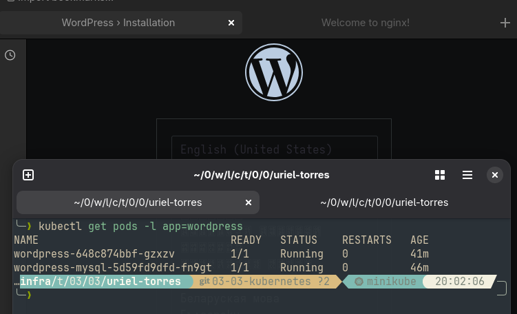

# 03-03 Kubernetes
## Prerrequisitos
Se hacen las siguientes configuraciones para el hipervisor:
```bash
sudo pacman -S qemu libvirt virt-manager dnsmasq
sudo usermod -aG libvirt $(whoami)
sudo systemctl start libvirtd
```

Se instala lo siguiente:
```bash
sudo pacman -S kubectl minikube
```

## Evidencia




